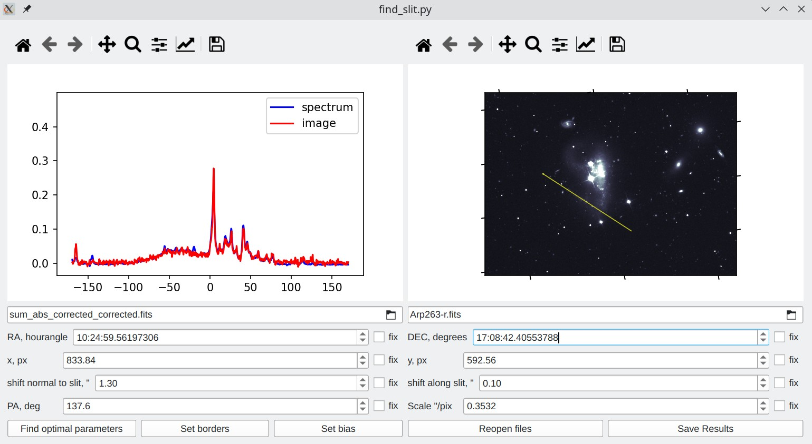
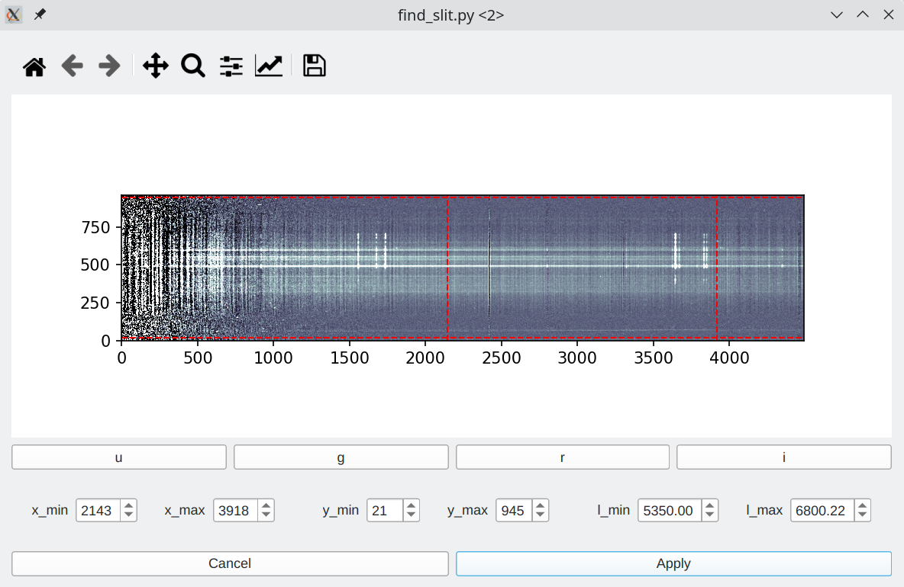

# find_slit
GUI for determining the precise position of a long-slit spectrum.

## Purpose of this program
In work with long-slit spectroscopy data, it is crucial to know the position of each spectral "row" 
(1-D spectrum that corresponds to the specific position at the slit). It is not always possible to
determine it during observations due to uncertainties in the telescope positioning, aberrations in the
optical system of a spectrograph, later correсtions in the reduction etc. So, one of the important steps
of spectral data processing is to perform the astrometrical calibration of the observation results.
The goal of this software is to make it possible to perform this calibration in a user-friendly way.

This program works with an image of an object or a sky region (photometry) and a spectrum of the same object.
Both files should be in the fits format, and several requirements for them are listed below.
The program finds the position of the slit where the total flux measured by spectroscopy (sum of the fluxes
at each wavelength) has the maximal correlation to the flux at the image at this slit position.
It is also possible not to use all the wavelengths but to specify the range,
this can be useful when the image is observed with some other instrument.

## Requirements to the files

#### Spectrum
The spectrum of an object should be presented as a fits-file with a 2D spectrum in its first HDU.
It is considered that the positional coordinate along the slit is the Y-coordinate
(vertical axis, has index 2 in the header keywords),
and the wavelength coordinate is the X-coordinate (horizontal, has index 1 in the keywords).
The flux at each pixel
can be set in any linear units (e.g. ADU/pix, erg/s/cm^2, but not the magnitude).

The necessary keywords for the header of this HDU are:
 - RA – right ascension of the spectrum CRPIX2
 - DEC – declination of the spectrum CRPIX2
 - NAXIS2 – number of pixels along the slit

The optional but important keywords are:
 - EPOCH – reference epoch (for RA and DEC), 2000.0 by default
 - CDELT2 – the size of a pixel along the slit in arcseconds, 0.3 "/pix by default
 - CRPIX2 – reference position (pix) along the slit, the centre of the slit by default
 - POSANG – the positional angle of the slit in degrees, 0 by default
 - PARANGLE and ROTANGLE – alternative way to set the positional angle; if these values are set, then POSANG=PARANGLE-ROTANGLE+132.5
 - SLIT – width of the slit in arcsec, 1 by default; this value can also be parsed from the 'Nasec'-like SLIT keyword, where N is integer or float
 - CDELT1, CRPIX1, CRVAL1 – parameters that are necessary if you want to set wavelength limits, they describe wavelength coordinates in the spectrum

#### Photometry
The photometry of an object/sky region should also be a fits-file with a 2D image in its first HDU.
It should have the correct WCS keywords in the header.
One of the best ways to obtain a fits-file with correct WCS keywords is to
use astrometry.net for the astrometrical calibration.

## Installation
Currently, this software has only been tested on Linux systems and Python 3.10.

First of all, you need to install the necessary packages:
 - numpy
 - matplotlib
 - scipy
 - astropy
 - reproject
 - PySide6

You can do it in any way you prefer. The easiest way (but not the best one) is this command:

`pip install numpy matplotlib scipy astropy reproject PySide6`

Then you can clone this repository in any folder and make the main script executable:

```
git clone https://github.com/CosmicHitchhiker/FindSlit.git
cd FindSlit
chmod a+x find_slit.py
```
## Usage

### Interface

 <p align="center">
  
</p>

#### Images
There are two images in the main window.

The left one is the plot of the normalised fluxes. The blue line is the spectrum
flux (sum across all wavelengths at the given range). The red one is the flux from the image on the given position of
the slit.

The right image is the picture of an object with the slit plotted over it.

It is possible to manipulate both images (zoom, move, save)
with the standard matplotlib tools by clicking the pictograms on the top of the plots.

#### Paths to files
The left field is for the path of the file with spectrum, and the right field is for the path of the photometry file.
To open the file, click on the folder icon. Both files will be processed by the program when the "Reopen files" button is clicked.

#### Slit coordinates
The coordinates of a slit are the coordinates of its CRPIX2 given in the header of the spectrum fits file.
If no CRPIX2 keyword is presented in the header,
the middle of the slit (NAXIS2 divided by two) is used as the default value.

You can change the values of the coordinates by 'up' and 'down' arrows, by clicking on the arrow images on the corresponding field,
or by inserting the value manually. Holding the 'ctrl' button will multiply the default step by ten.

There are three ways to set the coordinates:
1) **RA** and **DEC**. Right accession and declination are in the ICRS coordinate system.
2) **x** and **y**. Position at the image (pixels).
3) Shifts **along** and **normal** to slit.

You can use any of them depending on your needs, the other fields will be recalculated automatically.

The 'fix' checkboxes allow you to fix some coordinates while finding optimal parameters.
Currently, it is not possible to fix values from different types of coordinates.

#### PA and scale
Two other parameters set the position of the slit.
'PA' (position angle) is the angle between the direction of the slit and the direction to the north celestial pole.
The direction of the slit is the direction from its bottom
(lowest Y-coordinate at the spectrum file) to its top (highest Y-coordinate).
'Scale' is the size of a pixel of the spectrum
file across the positional coordinate in arcseconds.

It is possible to change them the same way that you change the position. Note that the 'fix' checkbox does nothing for the PA parameter.

#### 'Find optimal parameters' button
Clicking on this button starts the calculation process to find the best fit for the parameters that are set in the fields above.
It usually takes 3 to 10 seconds. You can watch the progress in the terminal messages (if the program is run in the terminal).
The process of finding optimal parameters is the minimisation of the scalar multiplication of the normalised fluxes.
Optimal coordinates will be searched in the 30-arcsecond area. The optimal scale will be searched in the 5% range around the scale set in
the corresponding field.

#### 'Set borders' button
This button opens a dialogue window where you can set boundaries for the spectrum.

 <p align="center">
  
</p>

The image in this window is the 2-D spectrum, presented in the 'spectrum' fits file.
The first row of buttons allows you to set wavelength limits that correspond with SDSS photometric filters.
The second row lets you select limits for y or x-axis positions (pixel) or wavelengths (will be recalculated to x-limits).
After you set the limits, only the spectrum inside these bounds will be used for fitting and plotting.

#### 'Set bias' button
_NOTE: THIS FUNCTIONALITY IS NOT COMPLETELY IMPLEMENTED YET!_

This button opens a small dialogue box allowing you to set bias that will be subtracted from the image or spectrum.
The bias is set in the percentages of the range of values in the given image/spectrum.

#### 'Reopen files' button
Click on this button sets the spectrum and image in the program from the paths specified in the corresponding field.
It also resets the values in the coordinates, PA and scale fields to the values provided in the files.

#### 'Save results' button
This button saves all calculated parameters into the newly created file that you can set.
The file with the result is the copy of the input spectrum files with the next keyword in the header modified:
 - CDELT2 will be set to the 'scale' value
 - RA and DEC will be set to the corresponding coordinates values
 - if EPOCH is presented in the header, it will be set to 2000.0
 - POSANG will be set to the PA value
 - if no CRPIX2 is presented in the header, it will be set to NAXIS2 divided by two

### Basic usage
Basic usage consists of several steps:
 - Open necessary files (spectrum and photometry)
 - Set the slit position to the point which is close to the real position (not farther than 30 arcsec in each direction).
 - Check if PA is correct. Sometimes it is needed to subtract 180 degrees for a proper calculation.
 - Click the 'Find optimal parameters button'.
 - If you are satisfied with the results, save them.

### Advanced usage 
Sometimes you may need additional steps:
 - Set borders (limits) for wavelength range and y-axis coordinate in the spectrum
 - Subtract bias

It is also possible to set some parameters in the command line. For more information type `./find_slit.py -h` in the terminal.
_This feature is not completely implemented yet._

## Contact information and bug reports
If you want to discuss this software, you can contact me directly on GitHub or send an email to landervyu(at)gmail.com